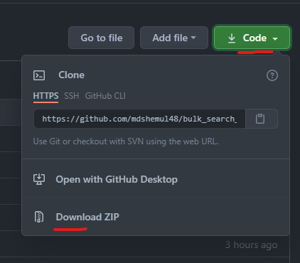
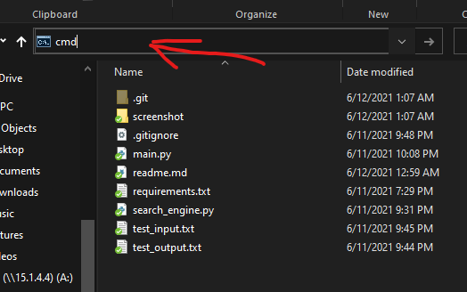
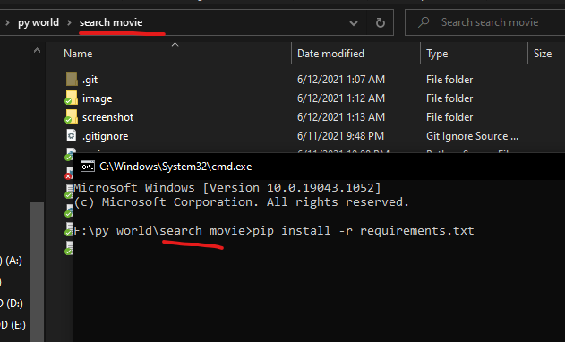

This script only useable for circle network users. It will search movies in bulk in circleftp. You have to provide the movie's name in a text file.

Then this script will search all those movies in circleftp.net and the script will give you another text file back with all search result and does it exist on circleftp or not confirmation.

## Example.

In `input.txt`, you added some movie's name and year. Then script will return you the search result of those movies.

in `input.txt`

```
Go Goa Gone 2013 1080p Gplay WEB-DL DDP 5.1 x264
Delhi Belly 2011 1080p NF WEB-DL x264 AVC Dual Audio [Hindi DD 5.1 + English DDP 5.1] ESubs

Say Salaam India 2007

```

The script will return another file that contains the result like below.

This text file will be auto-generated by the script.

You will get all the search results and links that match with your entered movies in this file.

`output.txt`

```

---------------------
Movie: The Misfits (2021) already exist in the server..
+---------
|
+---The Misfits (2021) 1080p HDRip x264
|   \---http://circleftp.net/cn/the-misfits-2021-1080p-hdrip-x264/
|      |
|      \---http://index.circleftp.net/FILE/..../The%20Misfits%20%282021%29%201080p%20HDRip%20x264.mp4
|
+---The Misfits (1961) 1080p BluRay x265
|   \---http://circleftp.net/cn/the-misfits-1961-1080p-bluray-x265/
|      |
|      \---http://index.circleftp.net/FILE/English%20Movies/../The.Misfits.1961.1080p.BluRay.x265-RARBG.mp4
|
+---Love.Everlasting.2016.HDRip.XviD.AC3-EVO.avi
|   \---http://circleftp.net/cn/love-everlasting-2016-hdrip-xvid-ac3-evo-avi/
|

---------------------
Movie: Ardha Shathabdham (2021) Telugu 1080p WEB-DL ESub already exist in the server..
+---------
|
+---Ardha Shathabdham (2021) Telugu 1080p WEB-DL ESub
|   \---http://circleftp.net/cn/ardha-shathabdham-2021-telugu-1080p-web-dl-esub/
|      |
|      \---http://index1.circleftp.net/FILE/Tamil%20Telugu%20%26%20Others/..../Ardha%20Shathabdham%20%282021%29%20Telugu%201080p%20WEB-DL%20ESub.mkv
|
|

---------------------
Movie: Bhavesh Joshi Superhero 2018 1080p NF WEB-DL AVC DDP 5.1 MSubs already exist in the server..
+---------
|
+---Bhavesh Joshi Superhero 2018 1080p NF WEB-DL AVC DDP 5.1 MSubs
|   \---http://circleftp.net/cn/bhavesh-joshi-superhero-2018-1080p-nf-web-dl-avc-ddp-5-1-msubs/
|      |
|      \---http://index1.circleftp.net/FILE/../Bhavesh%20Joshi%20Superhero%202018%201080p%20NF%20WEB-DL%20AVC%20DDP%205.1%20MSubs.mkv
|
|

---------------------
Movie: Wish Dragon (2021) 1080p WEBRip x264 already exist in the server..
+---------
|
+---Wish Dragon (2021) 1080p WEBRip x264
|   \---http://circleftp.net/cn/wish-dragon-2021-1080p-webrip-x264/
|      |
|      \---http://ftp5.circleftp.net/FILE/.../Wish%20Dragon%20%282021%29%201080p%20WEBRip%20x264.mp4
|
+---NCIS New Orleans (TV Series 2014-)
|   \---http://circleftp.net/cn/ncis-new-orleans-tv-series-2014/
+---Are You Afraid of the Dark (TV Series 1990-2000)
|   \---http://circleftp.net/cn/are-you-afraid-of-the-dark-tv-series-1990-2000/
|

```

## Installation and setup.

#### 1st step.

First of all, you have to install python.
Click this link below and download python from the official website.

https://www.python.org/

During installation click,`add python to path`. This is an essential part of python installation.


#### 2nd step.

Download this entire git repo by clicking `code > Download Zip`.



After download complete. Extract the file.

#### 3rd step.

After extracting, open extracted folder and click in the place of the folder path. Type `cmd` and hit `Enter`.



In that cmd prompt, type `pip install -r requirements.txt` and hit `Enter`. Then wait for the completion.



Installation is done!

## How to use it?

To use it, you have to create a text file without space in the name. In that text file, write the movie's title and year that you want to search.


Open the cmd in this folder and type the command below.

```
F:\....\search movie>py main.py file_name_that_you_created.txt
```

(In my case, I created `test_input.txt`)

Then hit Enter.


After the done message, you will found a new file in the directory called `search_result.txt`.

In that file, you will get the movie's search results with download links if that's already available on our server.

That's it, thank you. :P
